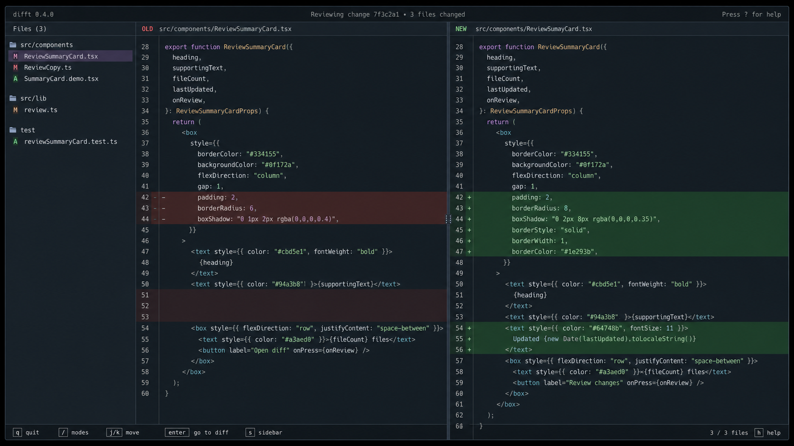
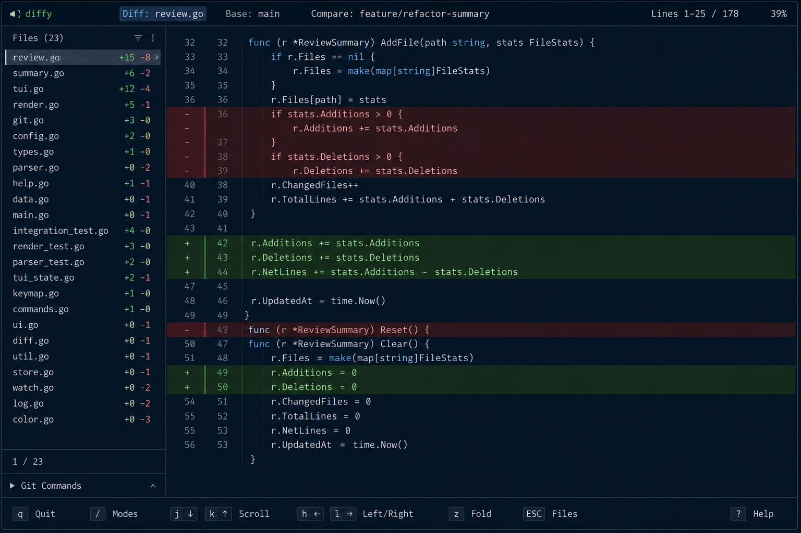
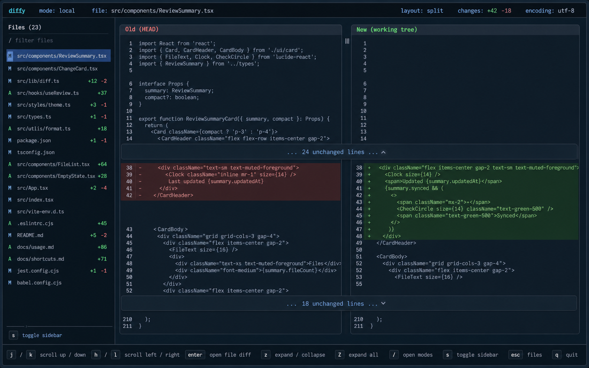

# IntelliJ-Style Diff Renderer Plan

This document designs the next renderer direction for Diffy. It is a plan only. Do not implement the renderer architecture changes until the approach is reviewed and approved.

The goal is to move from rendering Git patch text into a terminal to rendering an editor-like diff viewer. The UI should feel closer to IntelliJ's diff viewer: two synchronized editor panes, fixed gutters, clear change blocks, collapsed unchanged sections, and keyboard-first navigation.

## Reference Mockups

These images are generated design references for the desired direction. They are not exact implementation screenshots.

### Split Editor Windows



Key ideas:

- Left and right sides are separate editor panes.
- The separator is a real pane boundary, not a `|` character in every row.
- Line numbers live in fixed gutters.
- Deleted rows are highlighted on the left.
- Added rows are highlighted on the right.
- Blank filler rows preserve vertical alignment.
- The file list remains visible and navigable.

### Unified Editor View



Key ideas:

- Unified mode still looks like an editor, not raw `git diff`.
- Old/new line numbers and change markers live in a gutter.
- Add/delete backgrounds span the row.
- Raw patch syntax is hidden.
- Horizontal scroll should move only code text, not the gutter.

### Collapsed Context



Key ideas:

- Large unchanged sections collapse into a single row.
- The collapsed row spans both panes.
- Users can expand/collapse context from the keyboard.
- Expanded context should preserve synced line numbers on both sides.

## Problems With The Current Renderer

The current renderer is still too close to colored patch output:

- It creates split view as one text row with left text, a pipe divider, and right text.
- The center separator is part of rendered text instead of a pane boundary.
- Hunk metadata like `@@ -70,6 +70,9 @@` can leak into the visible UI.
- Horizontal scrolling is handled after text rows have already been assembled.
- There is no stable distinction between gutter text and code text.
- Unchanged context is shown as ordinary rows only; it cannot be collapsed or expanded cleanly.

## Product Goals

- Render diffs like code editor panes, not raw Git patch output.
- Hide Git patch metadata from normal UI.
- Keep split and unified layouts consistent.
- Preserve keyboard-first navigation.
- Keep the file list navigable without entering the diff pane.
- Support collapsed unchanged sections with expand/collapse controls.
- Keep horizontal scrolling predictable.
- Keep raw Git output available through `--raw`.

## Non-Goals

- Do not copy or depend on Hunk's framework.
- Do not build a browser UI.
- Do not add mutation features beyond the approved stash actions.
- Do not replace Git as the source of diff data.
- Do not implement inline word-level diff in this pass unless separately approved.

## Target Interaction Model

Default focus is the file/sidebar list.

Sidebar focus:

- `j/k`: move through files, commits, or stashes.
- `enter`: focus the diff pane.
- `f`: restrict to a file when no restriction is active.
- `esc`: clear file restriction when a restriction is active.
- `s`: toggle sidebar.
- `/`: open global mode palette.

Diff focus:

- `j/k`: scroll vertically.
- `h/l`: scroll code horizontally.
- `z`: expand or collapse the current unchanged section.
- `Z`: expand or collapse all unchanged sections.
- `esc`: return to sidebar focus.
- `1`: unified layout.
- `2`: split layout.

Mouse support:

- Click file rows to select a file.
- Scroll the diff pane with the mouse wheel.
- Click collapsed section rows to toggle them if the terminal event support is reliable.

## Split View Design

Split view should be rendered as two panes joined by layout, not by text concatenation.

Conceptual layout:

```text
left sidebar | old pane | divider | new pane
```

Each pane has:

- a pane header
- a fixed gutter
- a horizontally scrollable code area
- row backgrounds for additions/deletions/context

The panes share a single row model so vertical alignment is deterministic.

### Split Row Rules

Context row:

- left pane shows old line number and text
- right pane shows new line number and text
- both sides use normal row background

Delete row:

- left pane shows old line number and deleted text
- right pane shows a blank filler row
- left row background is red

Add row:

- left pane shows a blank filler row
- right pane shows new line number and added text
- right row background is green

Modified block:

- consecutive deletions followed by consecutive additions should be paired by row where possible
- extra old or new rows become blank filler on the opposite side

Collapsed context row:

- spans both panes
- shows text such as `... 24 unchanged lines ...`
- has a muted background
- has an expand/collapse marker

## Unified View Design

Unified mode should not show raw `@@` hunk headers.

Each row has:

- old line number column
- new line number column
- change marker column
- code text area

Row rules:

- context: both old and new line numbers populated
- delete: old line number only, delete marker, red background
- add: new line number only, add marker, green background
- collapsed context: full-width muted row

## Structured Renderer Model

Introduce a renderer-owned data model separate from raw Git output.

Suggested model:

```go
type DiffDocument struct {
    Files []DiffFile
}

type DiffFile struct {
    OldPath string
    NewPath string
    Rows    []DiffRow
}

type DiffRow struct {
    Kind      DiffRowKind
    OldLine   int
    NewLine   int
    OldText   string
    NewText   string
    Collapsed *CollapsedContext
}

type DiffRowKind string

const (
    RowContext   DiffRowKind = "context"
    RowAdd       DiffRowKind = "add"
    RowDelete    DiffRowKind = "delete"
    RowModify    DiffRowKind = "modify"
    RowBlank     DiffRowKind = "blank"
    RowCollapsed DiffRowKind = "collapsed"
)

type CollapsedContext struct {
    Count    int
    Expanded bool
    Rows     []DiffRow
}
```

The exact struct names can change. The important boundary is:

- Git patch parsing produces structured rows.
- The TUI renders structured rows.
- `--raw` still prints raw Git output.

## Parsing Plan

Keep using Git commands for source data:

- `git diff --no-ext-diff`
- `git diff --numstat`
- `git diff --name-only`
- `git show --no-ext-diff`
- `git stash show --no-ext-diff -p`

Patch parser responsibilities:

- identify file boundaries from `diff --git`
- capture old/new paths from `---` and `+++`
- parse hunk ranges from `@@`
- assign old and new line numbers
- classify rows as context/add/delete/note
- pair delete/add blocks into split rows
- hide patch metadata from visible rendering

Parser should treat raw patch metadata as structure, not as display text.

## Collapsed Context Design

Default behavior:

- Keep small context blocks visible.
- Collapse larger context blocks between changes.
- A reasonable first default is to keep 3 unchanged rows around each change and collapse the middle.

Rules:

- Do not collapse context at the very top or bottom if it is already short.
- Collapsed rows should preserve total old/new line counts internally.
- Expanding a collapsed row should restore the original context rows in-place.
- Collapsing all should be reversible without reparsing Git output.

Keyboard:

- `z`: toggle collapsed section under or nearest the viewport cursor.
- `Z`: toggle all collapsed sections.

Open decision:

- We need to decide how the viewport cursor works inside the diff pane. A simple version can use the first visible collapsed row as the target for `z`.

## Horizontal Scrolling

Horizontal scroll should affect only code text.

Do not scroll:

- pane borders
- gutters
- line numbers
- change markers
- collapsed-section labels

Do scroll:

- old code text
- new code text
- unified code text

This means the renderer must slice code content after gutter layout is calculated.

## TUI State Changes

Likely state additions:

```go
type tuiModel struct {
    diffFocused bool
    vScroll     int
    hScroll     int
    diffCursor  int
    expanded    map[string]bool
}
```

The actual names can stay close to current state, but we need a distinct diff cursor or target row if collapse toggling is added.

## Rendering Plan

Rendering should happen in layers:

1. Parse raw diff into `DiffDocument`.
2. Select active `DiffFile`.
3. Derive visible rows after collapse settings.
4. Apply vertical viewport.
5. Render rows into split or unified pane strings.
6. Compose sidebar, panes, top bar, and bottom bar.

Split renderer:

- render old pane and new pane independently
- join them with a layout divider
- never include a `|` separator inside code rows

Unified renderer:

- render a single pane with old/new gutter columns
- reuse the same visible row model

## Test Plan

Parser tests:

- parses hunk ranges correctly
- assigns old/new line numbers correctly
- hides `@@` from display rows
- keeps content lines that literally contain patch-like text
- handles new files and deleted files

Split rendering tests:

- no visible raw `@@`
- no visible `diff --git`, `---`, or `+++`
- add rows render right-side only
- delete rows render left-side only
- context rows render both sides
- blank filler rows preserve alignment
- no text pipe divider inside row content

Unified rendering tests:

- no visible raw hunk headers
- old/new gutter values are correct
- added/deleted rows use separate markers
- horizontal scroll does not move gutters

Collapse tests:

- large context block collapses by default
- small context block stays visible
- `z` toggles one collapsed block
- `Z` toggles all collapsed blocks
- expanded rows preserve old/new line numbers

Interaction tests:

- default focus stays on file list
- `enter` focuses diff
- `esc` returns to file list
- `h/l` scroll code horizontally in diff focus
- `j/k` scroll vertically in diff focus
- `esc clear file` still works outside diff focus

## Implementation Phases

Each phase should be reviewed before moving to the next one.

### Phase 1: Data Model And Parser

Add the structured row model and parser tests. Do not change the TUI rendering yet except through isolated tests.

Deliverable:

- parser converts raw patch into structured rows
- no behavior change in the live app unless explicitly approved

### Phase 2: Split Pane Renderer

Replace pipe-based split rendering with two pane rendering.

Deliverable:

- old/new panes are visually separate
- gutters are fixed
- raw hunk headers are hidden
- add/delete/context alignment is correct

### Phase 3: Unified Renderer

Move unified view onto the same structured row model.

Deliverable:

- unified mode hides raw patch metadata
- unified mode has old/new gutters and row backgrounds

### Phase 4: Collapsed Context

Add collapsed unchanged sections and keyboard toggles.

Deliverable:

- collapsed rows render correctly
- `z` and `Z` work in diff focus
- tests cover collapse state

### Phase 5: Polish

Tune colors, headers, borders, and shortcut text.

Deliverable:

- final UI matches the approved direction closely enough for daily use

## Open Decisions

- Should line numbers be always visible, or configurable?
- Should split pane headers say `Old/New`, `Base/Current`, or resolved Git refs?
- How many unchanged context lines should remain visible by default?
- Should collapsed context be enabled by default in local changes?
- Should `z` target the nearest collapsed row or require a visible diff cursor?
- Should mouse click toggle collapsed context rows in version 1?
- Should modified blocks be paired naively by order, or should we add word-level matching later?

## Acceptance Criteria

The renderer redesign is acceptable when:

- normal TUI output does not show raw `@@` hunk headers
- split view uses two editor panes, not pipe-separated text rows
- line numbers are in gutters
- h/l horizontal scroll moves code text without moving gutters
- unchanged sections can be collapsed and expanded
- file navigation still works without entering diff focus
- `--raw` still returns raw Git output
- tests cover parser, split rendering, unified rendering, and collapse behavior

