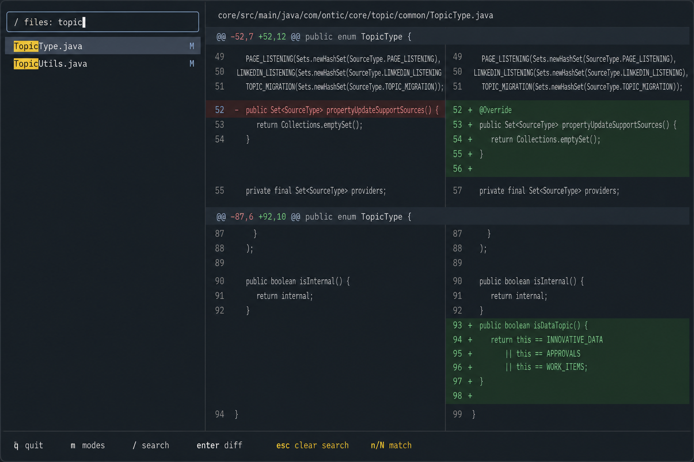
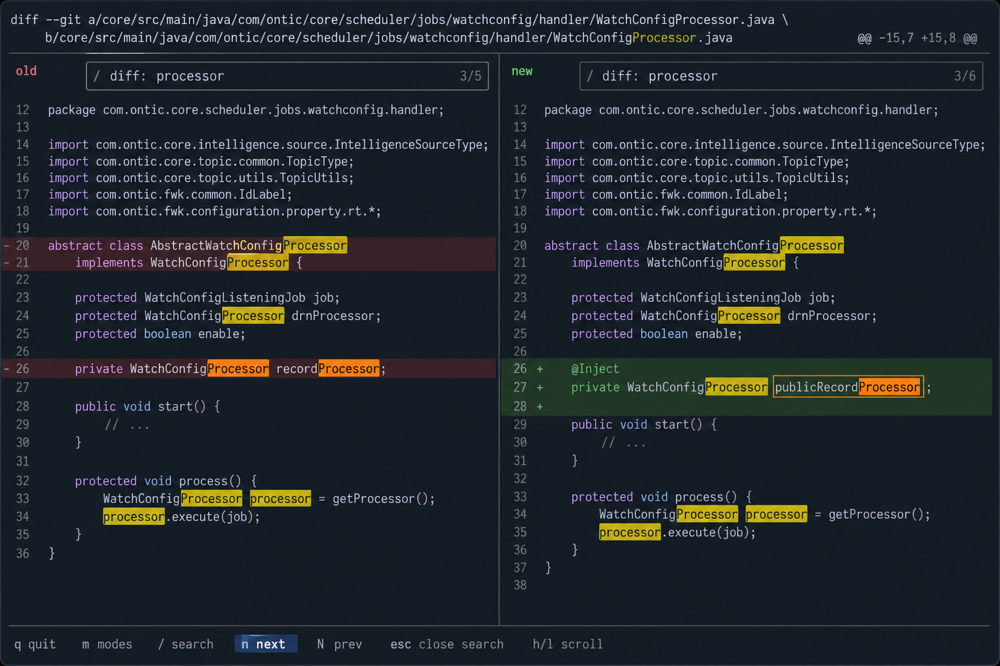

# Search Interaction Requirements

This document captures the desired search behavior before implementation.

The main correction is that search should not open a full popup/menu. Search should feel inline and local to the active pane.

## Sidebar Search



When the sidebar owns focus and the user presses `/`:

- A compact search box appears at the top of the sidebar.
- The search box is part of the sidebar, not a centered modal.
- The search box should only show `/` and the typed query. It should not include a label like `files:`.
- As the user types, sidebar rows filter live.
- Matching text inside the filtered rows is highlighted.
- Pressing `enter` locks in the current keyword.
- After `enter`, only the filtered rows remain visible.
- The keyword remains visible in the search box so the user knows the sidebar is filtered.
- Pressing `esc` clears the sidebar filter and restores the full sidebar list.

The sidebar search applies to the active sidebar type:

- file list
- commit list
- stash list

Expected shortcut behavior:

```text
/ search
enter lock search
esc clear search
j/k move filtered rows
```

## Diff Search



When the diff pane owns focus and the user presses `/`:

- A compact search box appears at the top of the diff pane.
- The search box is part of the diff pane, not a centered modal.
- The search box should only show `/`, the typed query, and the match count when available. It should not include a label like `diff:`.
- In split view, search covers both left and right panes.
- In unified view, search covers the unified rendered diff.
- Typing should highlight matches in the rendered diff.
- Pressing `enter` locks in the keyword.
- After `enter`, `n` moves to the next occurrence and `N` moves to the previous occurrence.
- Pressing `esc` closes or clears the active diff search state.

Search should run against the rendered diff, not raw Git output, because rendered diff is what the user sees.

## Highlighting

Sidebar:

- Highlight the matched keyword inside each filtered row.
- The selected row still uses the normal sidebar selection treatment.

Diff:

- Highlight every occurrence of the keyword.
- The current occurrence gets a stronger highlight than the other occurrences.
- Other occurrences should still be visible, but visually secondary.
- The active occurrence should be obvious enough that `n` and `N` feel trackable.

Suggested color intent:

- Other matches: yellow highlight.
- Current match: stronger orange/yellow highlight with higher contrast.

## Implementation Status

Implemented behavior should use inline search controls:

- sidebar search box inside the sidebar
- diff search box inside the diff pane
- no full-screen or centered search menu

The older popup search prompt is intentionally not part of the final design.
